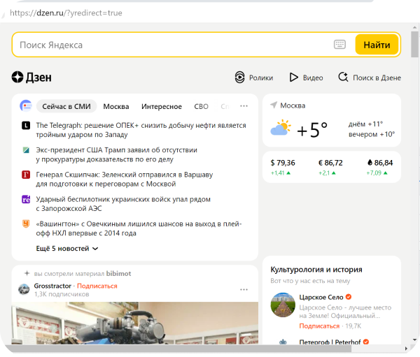
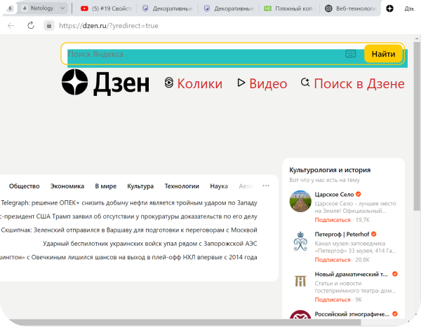

# Разбор сайта yandex.ru

## Cайт работает на протоколе **https**
## Структура сайта

1. Строка поиска, header
    ```html
    <div class = "dzen-desktop__search-37"> ...
    ```
2.  Раздел main, содержащий все остальные секции
1.  Main. Верхнее меню Дзен
   
    ```html
    <div class="dzen-top-controls-desktop__topControls-14">
    ```
4.  Main. Блок с короткими ссылками на новости
    ```html
    <article class="card-wrapper _is-desktop _is-desktop-redesign _theme_white _with-overflow-hidden card-news__container-2U">
    ```
5.  Сайд-бар. Погода
    ```html
    <article class="card-wrapper _is-desktop _is-desktop-redesign _theme_white _with-overflow-hidden geoblock-weather__container-3o">
    ```
5.  Сайд-бар. Курсы валют
    ```html
    <article class="card-wrapper _is-desktop _is-desktop-redesign _theme_white _with-overflow-hidden currency-rates__container-3P">
    ```
5.  Сайд-бар. Список каналов
    ```html
    <article class="card-wrapper _is-desktop _is-desktop-redesign _theme_white _with-overflow-hidden channels-list-sidebar__container-1r channels-list-sidebar__container_relative-18 channels-list-sidebar__container_sticky-1b">
    ```
5.  Main. Статья
    ```html
    <div class="feed__row _items-count_1" id="zen-row-1">
    ```
6.  Main. Статья
    ```html
    <div class="feed__row _items-count_1" id="zen-row-2">
    ```
 и т.д.

## Изменения с помощью **devtools**
Было:

Стало:


## Структура сайта в блоках
